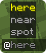
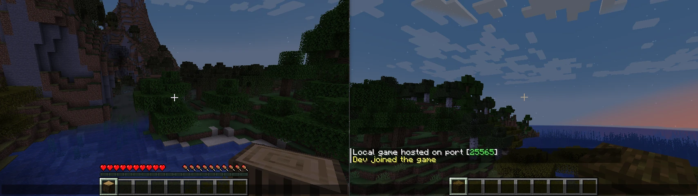
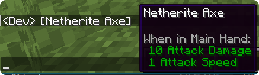
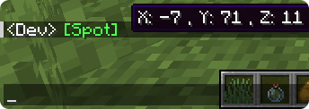

# Call You By Your Name 🎯

> A Forge 1.20.1 chat enhancement mod that makes @-mentions loud, clear, and friendly. 💬

## Feature Highlights ✨
**Ping teammates instantly:** Mention a player with `@playerName` to deliver a highlighted notification and a click-to-reply suggestion that pre-fills chat with their name, plus an optional bell sound.
- **Share what you're holding:** Drop `@item` into your message to broadcast your main-hand item with its rarity color, hover tooltip, and (optionally) an inline icon rendered directly in chat.
- **Point friends to your location:** Use `@spot` to insert a green "Spot" marker; hovering shows the XYZ of where you were standing when you sent the message.
- **Ready-made group calls:** Rally everyone in your dimension with `@here` or nearby allies with `@near`; additional groups can be provided by other mods through the built-in registry hook and sync automatically to clients.
- **Client-side clarity:** Color-coded highlighting for players, groups, and special tokens pairs with smart autocompletion, keeping mentions readable and fast to type without interfering with slash commands.

## Requirements 📦
- **Minecraft:** Java Edition 1.20.1
- **Loader:** Forge `47.4.10` or newer on both client and server

## Installation 🛠️
1. Install a compatible Forge profile for Minecraft 1.20.1.
2. Place the CallYouByYourName JAR in your `mods/` folder.
3. Restart Minecraft (or your dedicated server) to load the mod.

## Using Mentions 📚
| Token | What it does | Notes |
| --- | --- | --- |
| `@playerName` | Pings a single player with a golden reminder and clickable reply prompt. | You cannot ping yourself; duplicates are ignored politely. |
| `@here` | Notifies every other player in your current dimension. | Always available to all players. |
| `@near` | Calls allies within a ~32 block radius. | Range checks run per dimension to avoid cross-world noise. |
| `@item` | Shares your held item with tooltip info (and an inline icon if enabled). | Cancels the message and warns you if your hand is empty. |
| `@spot` | Inserts a highlighted "Spot" link that shows your XYZ on hover. | Great for pointing friends to your current location. |

  
  

> 💡 Tip: The chat will tell you how many seconds remain if you hit the mention cooldown.

## Client Experience 🌈
- Mention colors adapt to players, groups, shared items, and spot markers so you can scan conversations at a glance.
- Autocomplete surfaces group tokens, custom registry entries, and online players, but hides automatically while you type commands that start with `/`.
- Item mentions can render a scaled version of the item icon inline with the chat line while preserving hover hitboxes for easy inspection.
- Mention tokens from servers (or other mods) are synchronized automatically when you join, keeping everyone in step without a restart.

## Configuration ⚙️
The first launch creates `config/CallYouByYourName-common.toml`. Tweak the following options:
- `mentionCooldownMs` – Minimum delay between mentions sent by the same player (default `5000`). Set to `0` to disable the check.
- `enableMentionSound` – Whether to play the bell sound when a player is pinged (default `true`).
- `renderItemTextures` – Toggle rendering of inline item icons in chat (default `true`).

Reload the config or restart Minecraft to apply changes.

## Extending the Mod 🧩
Developers can add custom tokens by implementing `MentionGroupProvider` and registering via Java's `ServiceLoader`, instantly syncing those tokens to connected clients.

## Troubleshooting 🧰
- **"I can't use a group mention"** – Some third-party groups may require extra permissions; you'll receive a red warning if access is denied.
- **"Why don't I see suggestions?"** – Mention autocomplete only appears in standard chat and hides during command input.
- **"Item sharing failed"** – Make sure something is in your main hand before typing `@item`; the mod cancels the message otherwise.

## License 📜
Released under the **Apache License 2.0**. Contributions are welcome!

Have fun calling your friends by their names! 🎉